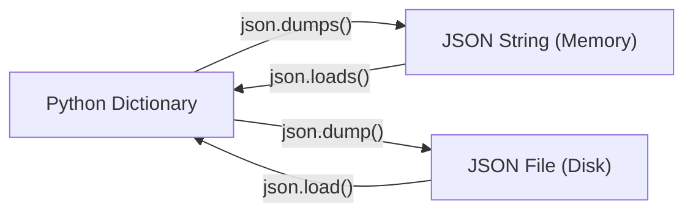

#aiml #prime2 #python #file-io #json #context-managers #interview-prep

> Navigation: [[Day 06 - File IO, Exceptions and Comprehensions]]

---

## The Core Overview / Summary

Variables and data stored in Python exist only in your computer's temporary memory (RAM). When your Python program stops running, that data vanishes.

To save information permanently, we use **File Handling (File I/O)** to write data to your computer's hard disk (as text files, CSVs, or JSON files) and read it back whenever we want.

| Tool / Mode | What It Does (In Simple Words) | Core Rule | Real-Life Analogy |
| :--- | :--- | :--- | :--- |
| **`open(file, mode)`** | Connects Python to a file on your disk | Always requires closing afterwards | Opening a notebook from your shelf |
| **Mode `'r'` (Read)** | Reads text from an existing file | Fails if the file does not exist | Reading a book page without writing |
| **Mode `'w'` (Write)** | Creates a new file or wipes existing file | **Overwrites everything!** | Erasing an entire whiteboard and writing anew |
| **Mode `'a'` (Append)** | Adds new text at the very end | Keeps old text intact | Adding a new entry at the bottom of a diary |
| **`with` statement** | Automatically closes the file when done | Best practice in modern Python | A hotel room door that locks itself automatically |
| **`json` module** | Saves and loads structured data | Bridges Python dictionaries with web text | A universal translator passport for data |

---

## 1. Opening, Reading, and Writing Files

### The 3 Core File Modes
```text
'r'  -> READ ONLY (File must already exist)
'w'  -> WRITE ONLY (Overwrites existing file completely or creates new one)
'a'  -> APPEND (Adds new lines at the bottom without deleting old content)
```

```python
# 1. Writing to a file (creates 'notes.txt')
file = open("notes.txt", "w")
file.write("Hello, this is my first saved file!\n")
file.close()  # Must manually close to save changes!

# 2. Reading from the file
file = open("notes.txt", "r")
content = file.read()
print(content)
file.close()
```

### The 3 Ways to Read Data
1. **`file.read()`**: Grabs the **entire file** as one single string.
2. **`file.readline()`**: Reads just **one single line** at a time.
3. **`file.readlines()`**: Reads all lines and packs them into a **list of strings**.

---

## 2. The `with` Statement (Context Manager)

### The Problem: Forgetting to Close Files
If you open a file with `open()` and your program crashes or you forget to write `file.close()`, the file stays locked in memory, causing memory leaks and corrupted data.

### The Solution: The Self-Locking Hotel Door
The **`with`** statement acts like a modern hotel room door. As soon as you step outside the block, Python **automatically closes the file for you**, even if an error occurs inside!

```python
# Modern Python standard (No need to call file.close()!)
with open("dataset.txt", "w") as file:
    file.write("Machine Learning Data Point 1\n")
    file.write("Machine Learning Data Point 2\n")

# Reading safely with 'with'
with open("dataset.txt", "r") as file:
    for line in file:
        print("Read line:", line.strip())
```

> [!NOTE]
> **Interview Definition:**  
> The **`with` statement** is a context manager in Python that automatically handles setup and teardown of resources. It guarantees that files are safely closed immediately after execution leaves the block.

---

## 3. Deleting Files Using the `os` Module

Python cannot delete files using standard file methods. We use the built-in **`os`** module.

```python
import os

filename = "old_data.txt"

# Always check if the file exists before deleting to prevent FileNotFoundError!
if os.path.exists(filename):
    os.remove(filename)
    print("File deleted successfully.")
else:
    print("File does not exist.")
```

---

## 4. Working with the `json` Module

In Machine Learning and web development, data is almost always exchanged in **JSON** (JavaScript Object Notation) format because it looks nearly identical to a Python dictionary.

### The 4 JSON Functions (Easy Formula to Remember)
Notice the letter **`s`**:
- **Functions ending with `s` (`dumps`, `loads`)** work with **Strings** in memory.
- **Functions without `s` (`dump`, `load`)** work directly with **Files** on disk.



```python
import json

student_info = {
    "name": "Adarsh",
    "course": "AIML Prime 2.0",
    "enrolled": True,
    "scores": [95, 88, 92]
}

# 1. Saving Python dictionary into a JSON file on disk
with open("student.json", "w") as file:
    json.dump(student_info, file, indent=4)

# 2. Reading JSON file back into a Python dictionary
with open("student.json", "r") as file:
    data = json.load(file)
    print(data["name"])  # Output: Adarsh
```

---

## Quick Interview Q&A (Cheatsheet)

### Q1: What is the danger of opening a file in `'w'` mode versus `'a'` mode?
> **Answer:**  
> Opening a file in `'w'` (write) mode immediately truncates and wipes out all existing contents of the file if it exists. In contrast, `'a'` (append) mode keeps existing data intact and writes new data at the end of the file.

### Q2: Why is using `with open(...)` preferred over manually calling `file.close()`?
> **Answer:**  
> The `with` statement uses Python's context manager protocol. It guarantees that the file descriptor is cleanly closed as soon as the block exits, even if an unexpected exception occurs inside the block.

### Q3: What is the difference between `json.dump()` and `json.dumps()`?
> **Answer:**  
> `json.dump()` writes Python data directly into a **file stream** on disk. `json.dumps()` (dump string) serializes Python data into a formatted **JSON string** in memory.

### Q4: How do you safely delete a file in Python without crashing if the file is missing?
> **Answer:**  
> Use `os.path.exists("filename")` to verify that the file exists before calling `os.remove("filename")` to avoid a `FileNotFoundError`.
