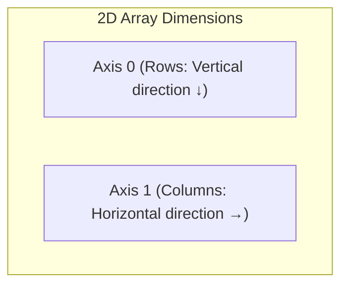

#aiml #prime2 #python #numpy #slicing #copy-vs-view #reshaping #interview-prep

> Navigation: [[Day 09 - NumPy]]

---

## The Core Overview / Summary

Working with data in Machine Learning requires slicing feature tables, cropping image pixels, and restructuring tensor shapes. NumPy allows multi-dimensional indexing and slicing with clean comma syntax (`arr[row, col]`).

However, NumPy handles memory differently from standard Python lists: slicing an array creates a **View**, not a **Copy**. Modifying a sliced view will unexpectedly modify the original array if you are not careful!

| Concept | What It Does (In Simple Words) | Core Rule | Real-Life Analogy |
| :--- | :--- | :--- | :--- |
| **Axis 0** | Down the rows (Vertical direction) | Aggregates column-wise | Looking down an elevator shaft |
| **Axis 1** | Across the columns (Horizontal direction) | Aggregates row-wise | Looking left-to-right across a bookshelf |
| **View (Slice)** | A direct window looking at the same memory | Modifying it **changes original array** | Looking at someone through a clear window |
| **Copy (`.copy()`)** | A brand-new duplicated array in RAM | Safe and completely independent | Taking a printed photo of someone |
| **Reshape** | Changes dimensions without altering data | Total number of elements must remain identical | Rearranging 12 chocolates from a 2x6 box into a 3x4 box |

---

## 1. Multi-Dimensional Arrays & Understanding Axes

### The 1D, 2D, and 3D Mental Model
- **1D Array (Vector)**: A single row of numbers (like a ruler). `shape: (5,)`
- **2D Array (Matrix)**: A table with rows and columns (like an Excel sheet). `shape: (3, 4)`
- **3D Array (Tensor)**: A stack of 2D sheets (like pages in a book, or an RGB color image with Red, Green, Blue layers). `shape: (3, 28, 28)`



---

## 2. 2D Indexing and Slicing (The Comma Syntax)

In regular Python lists, you access 2D data by writing `matrix[row][col]`.  
In NumPy, you write it cleanly separated by a comma: **`arr[row, col]`**.

```python
import numpy as np

matrix = np.array([
    [10, 20, 30],
    [40, 50, 60],
    [70, 80, 90]
])

# 1. Grabbing a single element: row 1, col 2
print(matrix[1, 2])  # Output: 60

# 2. Slicing rows and columns: arr[row_range, col_range]
# Grab first 2 rows, and columns from index 1 onwards:
sub_matrix = matrix[0:2, 1:]
print(sub_matrix)
# [[20, 30],
#  [50, 60]]

# 3. Grabbing an entire row or column using ':'
first_row = matrix[0, :]     # [10, 20, 30]
second_column = matrix[:, 1] # [20, 50, 80]
```

---

## 3. The Dangerous Interview Trap: Copy vs. View

This is one of the most critical gotchas in Python numerical computing:

### The Real-World Analogy (Window vs. Polaroid Photo)
- **View**: Looking through a glass window at a person. If that person puts on a hat, what you see through the window changes because you are looking at the **same real person**.
- **Copy**: Taking a Polaroid photo of that person. If you draw a hat on the photo with a pen, the real person's head does not change!

### The Trap in Action
- In **Python lists**, slicing `list[0:2]` creates a **new copy**.
- In **NumPy**, slicing `arr[0:2]` creates a **VIEW** that points to the **exact same memory buffer**!

```python
# The Trap:
original = np.array([1, 2, 3, 4, 5])
slice_view = original[0:3]  # This is a VIEW!

slice_view[0] = 999  # Mutating the slice...

print(original)
# Output: [999, 2, 3, 4, 5]  <- Original array was mutated unexpectedly!
```

### The Safe Solution: Explicit `.copy()`
Whenever you want to modify sliced data without harming the original dataset, explicitly call **`.copy()`**:

```python
safe_copy = original[0:3].copy()
safe_copy[0] = 100

print(original[0])  # Still 999 (Safe and untouched!)
```

---

## 4. Reshaping Arrays (`.reshape()`)

You can reshape an array into different row and column layouts as long as the **total number of elements remains identical** ($2 \times 6 = 12$, $3 \times 4 = 12$).

```python
arr = np.arange(1, 13)  # 12 elements: [1, 2, 3 ... 12]

# Reshape into 3 rows, 4 columns
grid = arr.reshape(3, 4)
print(grid.shape)  # (3, 4)
```

### The `-1` Automatic Dimension Trick
If you know you want 2 rows, but don't want to calculate how many columns that leaves, pass **`-1`**. NumPy will do the math and calculate the missing dimension automatically:

```python
# Let NumPy figure out the column count:
auto_grid = arr.reshape(2, -1)
print(auto_grid.shape)  # Output: (2, 6)
```

### Flattening Back to 1D: `.flatten()` vs. `.ravel()`
- **`.flatten()`**: Collapses any multi-dimensional array into 1D and returns a **Copy**.
- **`.ravel()`**: Collapses into 1D and returns a **View** (faster, no memory duplication).

---

## Quick Interview Q&A (Cheatsheet)

### Q1: What is the fundamental difference between a NumPy slice and a Python list slice?
> **Answer:**  
> Slicing a Python list creates a shallow copy, whereas slicing a NumPy array creates a **view** sharing the exact same memory buffer. Mutating a NumPy slice mutates the underlying original array unless `.copy()` is used.

### Q2: What does passing `-1` inside `.reshape()` do?
> **Answer:**  
> `-1` tells NumPy to automatically calculate that specific dimension based on the array's total element count and the other specified dimensions.

### Q3: What is the difference between `arr.flatten()` and `arr.ravel()`?
> **Answer:**  
> Both flatten an N-dimensional array into a 1D array, but `.flatten()` always allocates a new copy in memory, while `.ravel()` returns a view of the original array whenever possible.

### Q4: In a 2D array, what does `axis=0` represent versus `axis=1`?
> **Answer:**  
> `axis=0` refers to the vertical direction across rows (collapsing rows to compute column stats). `axis=1` refers to the horizontal direction across columns (collapsing columns to compute row stats).
